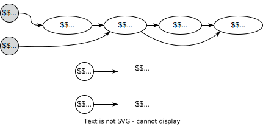
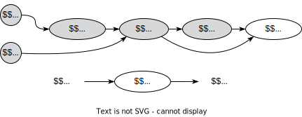
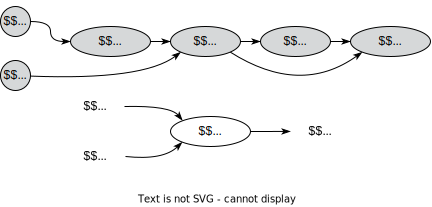
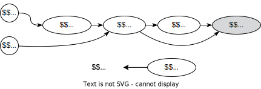
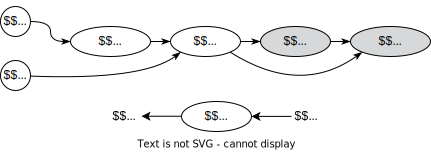
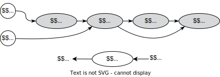
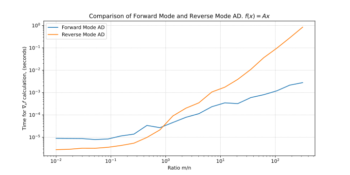
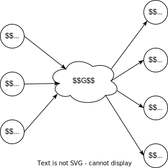
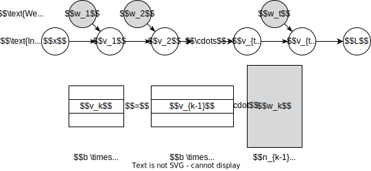
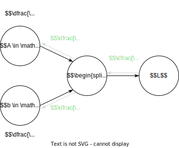

# Problem

Suppose we need to solve the following problem:

$$
L(w) \to \min_{w \in \mathbb{R}^d}
$$

Such problems typically arise in machine learning, when you need to find optimal hyperparameters $w$ of an ML model (i.e. train a neural network). You may use a lot of algorithms to approach this problem, but given the modern size of the problem, where $d$ could be dozens of billions it is very challenging to solve this problem without information about the gradients using zero-order optimization algorithms. That is why it would be beneficial to be able to calculate the gradient vector $\nabla_w L = \left( \frac{\partial L}{\partial w_1}, \ldots, \frac{\partial L}{\partial w_d}\right)^T$. Typically, first-order methods perform much better in huge-scale optimization, while second-order methods require too much memory.

# Finite differences

The naive approach to get approximate values of gradients is **Finite differences** approach. For each coordinate, one can calculate the partial derivative approximation:

$$
\dfrac{\partial L}{\partial w_k} (w) \approx \dfrac{L(w+\varepsilon e_k) - L(w)}{\varepsilon}, \quad e_k = (0, \ldots, \underset{{\tiny k}}{1}, \ldots, 0)
$$

:::{.callout-question}
If the time needed for one calculation of $L(w)$ is $T$, what is the time needed for calculating $\nabla_w L$ with this approach?

:::{.callout-answer collapse="true"}
$2dT$, which is extremely long for the huge scale optimization. Moreover, this exact scheme is unstable, which means that you will have to choose between accuracy and stability.
:::
:::

:::{.callout-theorem}
There is an algorithm to compute $\nabla_w L$ in $\mathcal{O}(T)$ operations. [^1]
:::

[^1]: Linnainmaa S. The representation of the cumulative rounding error of an algorithm as a Taylor expansion of the local rounding errors.  Master’s Thesis (in Finnish), Univ. Helsinki, 1970.

# Forward mode automatic differentiation

To dive deep into the idea of automatic differentiation we will consider a simple function for calculating derivatives: 

$$
L(w_1, w_2) = w_2 \log w_1 + \sqrt{w_2 \log w_1}
$$

Let's draw a *computational graph* of this function:


Let's go from the beginning of the graph to the end and calculate the derivative $\dfrac{\partial L}{\partial w_1}$:

|  Step | Function  | Derivative  | Scheme | 
|:-:|:--:|:--:|:------: |
| 1 |  $w_1 = w_1, w_2 = w_2$ | $\dfrac{\partial w_1}{\partial w_1} = 1, \dfrac{\partial w_2}{\partial w_1} = 0$  |  |
| 2 |  $v_1 = \log w_1$ | $\begin{aligned}\frac{\partial v_1}{\partial w_1} &= \frac{\partial v_1}{\partial w_1} \frac{\partial w_1}{\partial w_1}\\ &= \frac{1}{w_1} 1\end{aligned}$  |  |
| 3 |  $v_2 = w_2 v_1$  | $\begin{aligned}\frac{\partial v_2}{\partial w_1} &= \frac{\partial v_2}{\partial v_1}\frac{\partial v_1}{\partial w_1} + \frac{\partial v_2}{\partial w_2}\frac{\partial w_2}{\partial w_1} \\&= w_2\frac{\partial v_1}{\partial w_1} + v_1\frac{\partial w_2}{\partial w_1}\end{aligned}$  |  |
| 4 |  $v_3 = \sqrt{v_2}$  | $\begin{aligned}\frac{\partial v_3}{\partial w_1} &= \frac{\partial v_3}{\partial v_2}\frac{\partial v_2}{\partial w_1} \\ &= \frac{1}{2\sqrt{v_2}}\frac{\partial v_2}{\partial w_1}\end{aligned}$  |  |
| 5 |  $L = v_2 + v_3$  | $\begin{aligned}\frac{\partial L}{\partial w_1} &= \frac{\partial L}{\partial v_2}\frac{\partial v_2}{\partial w_1} + \frac{\partial L}{\partial v_3}\frac{\partial v_3}{\partial w_1} \\&= 1\frac{\partial v_2}{\partial w_1} + 1\frac{\partial v_3}{\partial w_1}\end{aligned}$  |  |

:::{.callout-question}
Make the same computations for $\dfrac{\partial L}{\partial w_2}$

:::{.callout-solution collapse="true"}

|  Step | Function  | Derivative  | Scheme | 
|:-:|:--:|:--:|:------: |
| 1 |  $w_1 = w_1, w_2 = w_2$ | $\dfrac{\partial w_1}{\partial w_2} = 0, \dfrac{\partial w_2}{\partial w_2} = 1$  |  |
| 2 |  $v_1 = \log w_1$ | $\begin{aligned}\frac{\partial v_1}{\partial w_2} &= \frac{\partial v_1}{\partial w_2} \frac{\partial w_2}{\partial w_2}\\ &= 0 \cdot 1\end{aligned}$  |  |
| 3 |  $v_2 = w_2 v_1$  | $\begin{aligned}\frac{\partial v_2}{\partial w_2} &= \frac{\partial v_2}{\partial v_1}\frac{\partial v_1}{\partial w_2} + \frac{\partial v_2}{\partial w_2}\frac{\partial w_2}{\partial w_2} \\&= w_2\frac{\partial v_1}{\partial w_2} + v_1\frac{\partial w_2}{\partial w_2}\end{aligned}$  |  |
| 4 |  $v_3 = \sqrt{v_2}$  | $\begin{aligned}\frac{\partial v_3}{\partial w_2} &= \frac{\partial v_3}{\partial v_2}\frac{\partial v_2}{\partial w_2} \\ &= \frac{1}{2\sqrt{v_2}}\frac{\partial v_2}{\partial w_2}\end{aligned}$  |  |
| 5 |  $L = v_2 + v_3$  | $\begin{aligned}\frac{\partial L}{\partial w_2} &= \frac{\partial L}{\partial v_2}\frac{\partial v_2}{\partial w_2} + \frac{\partial L}{\partial v_3}\frac{\partial v_3}{\partial w_2} \\&= 1\frac{\partial v_2}{\partial w_2} + 1\frac{\partial v_3}{\partial w_2}\end{aligned}$  |  |

:::
:::

:::{.callout-theorem}

## Forward mode automatic differentiation algorithm

Suppose, we have a computational graph $v_i, i \in [1; N]$. Our goal is to calculate the derivative of the output of this graph with respect to some input variable $w_k$, i.e. $\dfrac{\partial v_N}{\partial w_k}$. This idea implies propagation of the gradient with respect to the input variable from start to end, that is why we can introduce the notation: 

$$
\overline{v_i} = \dfrac{\partial v_i}{\partial w_k}
$$


* For $i = 1, \ldots, N$:
    * Compute $v_i$ as a function of its parents (inputs) $x_1, \ldots, x_{t_i}$:
        $$
        v_i = v_i(x_1, \ldots, x_{t_i})
        $$
    * Compute the derivative $\overline{v_i}$ using the forward chain rule:
        $$
        \overline{v_i} = \sum_{j = 1}^{t_i}\dfrac{\partial v_i}{\partial x_j}\dfrac{\partial x_j}{\partial w_k}
        $$
:::

Note, that this approach does not require storing all intermediate computations, but one can see, that for calculating the derivative $\dfrac{\partial L}{\partial w_k}$ we need $\mathcal{O}(T)$ operations. This means, that for the whole gradient, we need $d\mathcal{O}(T)$ operations, which is the same as for finite differences, but we do not have stability issues, or inaccuracies now (the formulas above are exact).

# Backward mode automatic differentiation

We will consider the same function

$$
L(w_1, w_2) = w_2 \log w_1 + \sqrt{w_2 \log w_1}
$$

with a computational graph:


Assume, that we have some values of the parameters $w_1, w_2$ and we have already performed a forward pass (i.e. single propagation through the computational graph from left to right). Suppose, also, that we somehow saved all intermediate values of $v_i$. Let's go from the end of the graph to the beginning and calculate the derivatives $\dfrac{\partial L}{\partial w_1}, \dfrac{\partial L}{\partial w_1}$:

|  Step  | Derivative  | Scheme | 
|:-:|:--:|:------: |
| 1 | $\dfrac{\partial L}{\partial L} = 1$  |  |
| 2 |  $\begin{aligned}\frac{\partial L}{\partial v_3} &= \frac{\partial L}{\partial L} \frac{\partial L}{\partial v_3}\\ &= \frac{\partial L}{\partial L} 1\end{aligned}$  |  |
| 3 |  $\begin{aligned}\frac{\partial L}{\partial v_2} &= \frac{\partial L}{\partial v_3}\frac{\partial v_3}{\partial v_2} + \frac{\partial L}{\partial L}\frac{\partial L}{\partial v_2} \\&= \frac{\partial L}{\partial v_3}\frac{1}{2\sqrt{v_2}} +  \frac{\partial L}{\partial L}1\end{aligned}$  |  |
| 4 | $\begin{aligned}\frac{\partial L}{\partial v_1} &=\frac{\partial L}{\partial v_2}\frac{\partial v_2}{\partial v_1} \\ &= \frac{\partial L}{\partial v_2}w_2\end{aligned}$  |  |
| 5 |  $\begin{aligned}\frac{\partial L}{\partial w_1} &= \frac{\partial L}{\partial v_1}\frac{\partial v_1}{\partial w_1} \\&= \frac{\partial L}{\partial v_1}\frac{1}{w_1}\end{aligned}$ $\begin{aligned}\frac{\partial L}{\partial w_2} &= \frac{\partial L}{\partial v_2}\frac{\partial v_2}{\partial w_2} \\&= \frac{\partial L}{\partial v_1}v_1\end{aligned}$ |  |

:::{.callout-question}
Note, that for the same price of computations as it was in the forward mode we have the full vector of gradient $\nabla_w L$. Is it a free lunch? What is the cost of acceleration?

:::{.callout-answer collapse="true"}
Note, that for using the reverse mode AD you need to store all intermediate computations from the forward pass. This problem could be somehow mitigated with the gradient checkpointing approach, which involves necessary recomputations of some intermediate values. This could significantly reduce the memory footprint of the large machine-learning model. 
:::
:::

:::{.callout-theorem}

## Reverse mode automatic differentiation algorithm

Suppose, we have a computational graph $v_i, i \in [1; N]$. Our goal is to calculate the derivative of the output of this graph with respect to all inputs variable $w$, i.e. $\nabla_w v_N =  \left( \frac{\partial v_N}{\partial w_1}, \ldots, \frac{\partial v_N}{\partial w_d}\right)^T$. This idea implies propagation of the gradient of the function with respect to the intermediate variables from the end to the origin, that is why we can introduce the notation: 

$$
\overline{v_i}  = \dfrac{\partial L}{\partial v_i} = \dfrac{\partial v_N}{\partial v_i}
$$


* **FORWARD PASS** 
    
    For $i = 1, \ldots, N$:

    * Compute and store the values of $v_i$ as a function of its parents (inputs) 

* **BACKWARD PASS**
    
    For $i = N, \ldots, 1$:

    * Compute the derivative $\overline{v_i}$ using the backward chain rule and information from all of its children (outputs) ($x_1, \ldots, x_{t_i}$):
        $$
        \overline{v_i} = \dfrac{\partial L}{\partial v_i} = \sum_{j = 1}^{t_i} \dfrac{\partial L}{\partial x_j} \dfrac{\partial x_j}{\partial v_i}
        $$
:::

:::{.callout-example}
Which of the AD modes would you choose (forward/ reverse) for the following computational graph of primitive arithmetic operations? Suppose, you are needed to compute the jacobian $J = \left\{ \dfrac{\partial L_i}{\partial w_j} \right\}_{i,j}$


Note, that the reverse mode computational time is proportional to the number of outputs here, while the forward mode works proportionally to the number of inputs there. This is why it would be a good idea to consider the forward mode AD. 


:::

:::{.callout-question}
Which of the AD modes would you choose (forward/ reverse) for the following computational graph of primitive arithmetic operations? Suppose, you are needed to compute the jacobian $J = \left\{ \dfrac{\partial L_i}{\partial w_j} \right\}_{i,j}$. Note, that $G$ is an arbitrary computational graph



:::{.callout-answer collapse="true"}

It is generally impossible to say it without some knowledge about the specific structure of the graph $G$. Note, that there are also plenty of advanced approaches to mix forward and reverse mode AD, based on the specific $G$ structure.
:::
:::

:::{.callout-example}

## Feedforward Architecture



**FORWARD**

* $v_0 = x$ typically we have a batch of data $x$ here as an input.
* For $k = 1, \ldots, t-1, t$: 
    
    * $v_k = \sigma(v_{k-1}w_k)$. Note, that practically speaking the data has dimension $x  \in \mathbb{R}^{b \times d}$, where $b$ is the batch size (for the single data point $b=1$). While the weight matrix $w_k$ of a $k$ layer has a shape $n_{k-1} \times n_k$, where $n_k$ is the dimension of an inner representation of the data. 

* $L = L(v_t)$ - calculate the loss function.

**BACKWARD**

* $v_{t+1} = L, \dfrac{\partial L}{\partial L} = 1$
* For $k = t, t-1, \ldots, 1$: 
    
    * $\underset{b \times n_k}{\dfrac{\partial L}{\partial v_k}} = \underset{b \times n_{k+1}}{\dfrac{\partial L}{\partial v_{k+1}}} \underset{n_{k+1} \times n_k}{\dfrac{\partial v_{k+1}}{\partial v_{k}}}$
    * $\underset{b \times n_{k-1} \cdot n_k}{\dfrac{\partial L}{\partial w_k}} = \underset{b \times n_{k+1}}{\dfrac{\partial L}{\partial v_{k+1}}} \cdot  \underset{n_{k+1} \times n_{k-1} \cdot n_k}{\dfrac{\partial v_{k+1}}{\partial w_{k}}}$
:::

:::{.callout-example}

## Gradient propagation through the linear least squares



Suppose, we have an invertible matrix $A$ and a vector $b$, the vector $x$ is the solution of the linear system $Ax = b$, namely one can write down an analytical solution $x = A^{-1}b$, in this example we will show, that computing all derivatives $\dfrac{\partial L}{\partial A}, \dfrac{\partial L}{\partial b}, \dfrac{\partial L}{\partial x}$, i.e. the backward pass, costs approximately the same as the forward pass.

It is known, that the differential of the function does not depend on the parametrization:

$$
dL = \left\langle\dfrac{\partial L}{\partial x}, dx \right\rangle = \left\langle\dfrac{\partial L}{\partial A}, dA \right\rangle + \left\langle\dfrac{\partial L}{\partial b}, db \right\rangle
$$

Given the linear system, we have:

$$
\begin{align*}
Ax &= b \\
dAx + Adx = db &\to dx = A^{-1}(db - dAx)
\end{align*}
$$

The straightforward substitution gives us:

$$
\left\langle\dfrac{\partial L}{\partial x}, A^{-1}(db - dAx) \right\rangle = \left\langle\dfrac{\partial L}{\partial A}, dA \right\rangle + \left\langle\dfrac{\partial L}{\partial b}, db \right\rangle
$$

$$
\left\langle -A^{-T}\dfrac{\partial L}{\partial x} x^T, dA \right\rangle + \left\langle A^{-T}\dfrac{\partial L}{\partial x},db \right\rangle = \left\langle\dfrac{\partial L}{\partial A}, dA \right\rangle + \left\langle\dfrac{\partial L}{\partial b}, db \right\rangle
$$

Therefore:

$$
\dfrac{\partial L}{\partial A} = -A^{-T}\dfrac{\partial L}{\partial x} x^T \quad \dfrac{\partial L}{\partial b} =  A^{-T}\dfrac{\partial L}{\partial x}
$$

It is interesting, that the most computationally intensive part here is the matrix inverse, which is the same as for the forward pass. Sometimes it is even possible to store the result itself, which makes the backward pass even cheaper.

:::

:::{.callout-example}

## Gradient propagation through the SVD

Suppose, we have the rectangular matrix $W \in \mathbb{R}^{m \times n}$, which has a singular value decomposition:

$$
W = U \Sigma V^T, \quad U^TU = I, \quad V^TV = I, \quad \Sigma = \text{diag}(\sigma_1, \ldots, \sigma_{\min(m,n)})
$$

1. Similarly to the previous example:

    $$
    \begin{split}
    W &= U \Sigma V^T \\
    dW &= dU \Sigma V^T + U d\Sigma V^T + U \Sigma dV^T \\
    U^T dW V &= U^TdU \Sigma V^TV + U^TU d\Sigma V^TV + U^TU \Sigma dV^TV \\
    U^T dW V &= U^TdU \Sigma + d\Sigma + \Sigma dV^TV
    \end{split}
    $$

2. Note, that $U^T U = I \to dU^TU + U^T dU = 0$. But also $dU^TU = (U^T dU)^T$, which actually involves, that the matrix $U^TdU$ is antisymmetric:

    $$
    (U^T dU)^T +  U^T dU = 0 \quad \to \quad \text{diag}( U^T dU) = (0, \ldots, 0)
    $$

    The same logic could be applied to the matrix $V$ and

    $$
    \text{diag}(dV^T V) = (0, \ldots, 0)
    $$

3. At the same time, the matrix $d \Sigma$ is diagonal, which means (look at the 1.) that

    $$
    \text{diag}(U^T dW V) = d \Sigma 
    $$

    Here on both sides, we have diagonal matrices.

4. Now, we can decompose the differential of the loss function as a function of $\Sigma$ - such problems arise in ML problems, where we need to restrict the matrix rank:

    $$
    \begin{split}
    dL &= \left\langle\dfrac{\partial L}{\partial \Sigma}, d\Sigma \right\rangle \\
    &= \left\langle\dfrac{\partial L}{\partial \Sigma}, \text{diag}(U^T dW V)\right\rangle \\
    &= \text{tr}\left(\dfrac{\partial L}{\partial \Sigma}^T \text{diag}(U^T dW V) \right)
    \end{split}
    $$

    As soon as we have diagonal matrices inside the product, the trace of the diagonal part of the matrix will be equal to the trace of the whole matrix:

    $$
    \begin{split}
    dL &= \text{tr}\left(\dfrac{\partial L}{\partial \Sigma}^T \text{diag}(U^T dW V) \right) \\
    &= \text{tr}\left(\dfrac{\partial L}{\partial \Sigma}^T U^T dW V \right)  \\
    &= \left\langle\dfrac{\partial L}{\partial \Sigma}, U^T dW V \right\rangle \\
    &= \left\langle U \dfrac{\partial L}{\partial \Sigma} V^T, dW \right\rangle 
    \end{split}
    $$

5. Finally, using another parametrization of the differential

    $$
    \left\langle U \dfrac{\partial L}{\partial \Sigma} V^T, dW \right\rangle = \left\langle\dfrac{\partial L}{\partial W}, dW \right\rangle
    $$

    $$
    \dfrac{\partial L}{\partial W} =  U \dfrac{\partial L}{\partial \Sigma} V^T,
    $$

    This nice result allows us to connect the gradients $\dfrac{\partial L}{\partial W}$ and $\dfrac{\partial L}{\partial \Sigma}$.
:::

## What automatic differentiation (AD) is NOT:

* AD is not a finite differences
* AD is not a symbolic derivative
* AD is not just the chain rule
* AD is not just backpropagation
* AD (reverse mode) is time-efficient and numerically stable
* AD (reverse mode) is memory inefficient (you need to store all intermediate computations from the forward pass). 
:::


# Important stories from matrix calculus
We will illustrate some important matrix calculus facts for specific cases

## Univariate chain rule
Suppose, we have the following functions $R: \mathbb{R} \to \mathbb{R} , L: \mathbb{R} \to \mathbb{R}$ and $W \in \mathbb{R}$. Then

$$
\dfrac{\partial R}{\partial W} = \dfrac{\partial R}{\partial L} \dfrac{\partial L}{\partial W}
$$

## Multivariate chain rule

The simplest example:

$$
\dfrac{\partial }{\partial t} f(x_1(t), x_2(t)) = \dfrac{\partial f}{\partial x_1} \dfrac{\partial x_1}{\partial t} + \dfrac{\partial f}{\partial x_2} \dfrac{\partial x_2}{\partial t}
$$

Now, we'll consider $f: \mathbb{R}^n \to \mathbb{R}$:

$$
\dfrac{\partial }{\partial t} f(x_1(t), \ldots, x_n(t)) = \dfrac{\partial f}{\partial x_1} \dfrac{\partial x_1}{\partial t} + \ldots + \dfrac{\partial f}{\partial x_n} \dfrac{\partial x_n}{\partial t}
$$

But if we will add another dimension $f: \mathbb{R}^n \to \mathbb{R}^m$, than the $j$-th output of $f$ will be:

$$
\dfrac{\partial }{\partial t} f_j(x_1(t), \ldots, x_n(t)) = \sum\limits_{i=1}^n \dfrac{\partial f_j}{\partial x_i} \dfrac{\partial x_i}{\partial t} = \sum\limits_{i=1}^n J_{ji}  \dfrac{\partial x_i}{\partial t},
$$

where matrix $J \in \mathbb{R}^{m \times n}$ is the jacobian of the $f$. Hence, we could write it in a vector way:

$$
\dfrac{\partial f}{\partial t} = J \dfrac{\partial x}{\partial t}\quad \iff \quad \left(\dfrac{\partial f}{\partial t}\right)^\top =  \left( \dfrac{\partial x}{\partial t}\right)^\top J^\top
$$

## Backpropagation
Backpropagation is a specific application of reverse-mode automatic differentiation within neural networks. It is the standard algorithm for computing gradients in neural networks, especially for training with stochastic gradient descent. Here’s how it works:

* Perform a forward pass through the network to compute activations and outputs.
* Calculate the loss function at the output, which measures the difference between the network prediction and the actual target values.
* Commence the backward pass by computing the gradient of the loss with respect to the network’s outputs.
* Propagate these gradients back through the network, layer by layer, using the chain rule to calculate the gradients of the loss with respect to each weight and bias.
* The critical point of backpropagation is that it efficiently calculates the gradient of a complex, multilayered function by decomposing it into simpler derivative calculations. This aspect makes the update of a large number of parameters in deep networks computationally feasible. 

## Jacobian vector product
The power of automatic differentiation is encapsulated in the computation of the Jacobian-vector product. Instead of calculating the entire Jacobian matrix, which is computationally expensive and often unnecessary, AD computes the product of the Jacobian and a vector directly. This is crucial for gradients in neural networks where the Jacobian may be very large, but the end goal is the product of this Jacobian with the gradient of the loss with respect to the outputs (vector). The reason why it works so fast in practice is that the Jacobian of the operations is already developed effectively in automatic differentiation frameworks. Typically, we even do not construct or store the full Jacobian, doing matvec directly instead. Note, for some functions (for example, any element-wise function of the input vector) matvec costs linear time, instead of quadratic and requires no additional memory to store a Jacobian.

:::{.callout-example}

## Example: element-wise exponent
$$
y = \exp{(z)} \qquad J = \text{diag}(\exp(z)) \qquad \overline{z} = \overline{y} J
$$
:::

See the examples of Vector-Jacobian Products from the autodidact library:

```python
defvjp(anp.add,         lambda g, ans, x, y : unbroadcast(x, g),
                        lambda g, ans, x, y : unbroadcast(y, g))
defvjp(anp.multiply,    lambda g, ans, x, y : unbroadcast(x, y * g),
                        lambda g, ans, x, y : unbroadcast(y, x * g))
defvjp(anp.subtract,    lambda g, ans, x, y : unbroadcast(x, g),
                        lambda g, ans, x, y : unbroadcast(y, -g))
defvjp(anp.divide,      lambda g, ans, x, y : unbroadcast(x,   g / y),
                        lambda g, ans, x, y : unbroadcast(y, - g * x / y**2))
defvjp(anp.true_divide, lambda g, ans, x, y : unbroadcast(x,   g / y),
                        lambda g, ans, x, y : unbroadcast(y, - g * x / y**2))
```

## Hessian vector product
Interestingly, a similar idea could be used to compute Hessian-vector products, which is essential for second-order optimization or conjugate gradient methods. For a scalar-valued function $f : \mathbb{R}^n \to \mathbb{R}$ with continuous second derivatives (so that the Hessian matrix is symmetric), the Hessian at a point $x \in \mathbb{R}^n$ is written as $\partial^2 f(x)$. A Hessian-vector product function is then able to evaluate

$$
v \mapsto \partial^2 f(x) \cdot v
$$

for any vector $v \in \mathbb{R}^n$.

The trick is not to instantiate the full Hessian matrix: if $n$ is large, perhaps in the millions or billions in the context of neural networks, then that might be impossible to store. Luckily, `grad` (in the jax/autograd/pytorch/tensorflow) already gives us a way to write an efficient Hessian-vector product function. We just have to use the identity

$$
\partial^2 f (x) v = \partial [x \mapsto \partial f(x) \cdot v] = \partial g(x),
$$

where $g(x) = \partial f(x) \cdot v$ is a new vector-valued function that dots the gradient of $f$ at $x$ with the vector $v$. Notice that we're only ever differentiating scalar-valued functions of vector-valued arguments, which is exactly where we know `grad` is efficient.


```python
import jax.numpy as jnp

def hvp(f, x, v):
    return grad(lambda x: jnp.vdot(grad(f)(x), v))(x)
```
# Code

[Open In Colab](https://colab.research.google.com/github/MerkulovDaniil/optim/blob/master/assets/Notebooks/Autograd_and_Jax.ipynb)

# Materials

* [Autodidact](https://github.com/mattjj/autodidact) - a pedagogical implementation of Autograd
* [CSC321](https://www.cs.toronto.edu/~rgrosse/courses/csc321_2018/slides/lec06.pdf) Lecture 6
* [CSC321](https://www.cs.toronto.edu/~rgrosse/courses/csc321_2018/slides/lec10.pdf) Lecture 10
* [Why](https://medium.com/@karpathy/yes-you-should-understand-backprop-e2f06eab496b) you should understand backpropagation :)
* [JAX autodiff cookbook](https://jax.readthedocs.io/en/latest/notebooks/autodiff_cookbook.html)
* [Materials](https://harvard-iacs.github.io/2019-CS207/lectures/lecture10/notebook/) from CS207: Systems Development for Computational Science course with very intuitive explanation.
* [Great lecture on AD](https://www.youtube.com/watch?v=za2LgI8JFCw) from Dmitry Kropotov (in Russian).