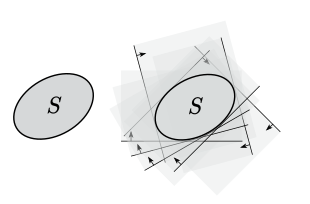
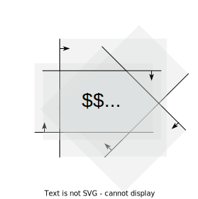

## Conjugate (Fenchel conjugate, dual, Fenchel dual) set

### Definitions

Let $S \subseteq \mathbb{R}^n$ be an arbitrary non-empty set. Then its conjugate set is defined as:

$$
S^* = \{y \in \mathbb{R}^n \mid \langle y, x\rangle \ge -1 \;\; \forall x \in S\}
$$

{#fig-conjugate_set}

A set $S^{**}$ is called double conjugate to a set $S$ if:

$$
S^{**} = \{y \in \mathbb{R}^n \mid \langle y, x\rangle \ge -1 \;\; \forall x \in S^*\}
$$

* The sets $S_1$ and $S_2$ are called **inter-conjugate** if $S_1^* = S_2, S_2^* = S_1$.
* A set $S$ is called **self-conjugate** if $S^{*} = S$.

### Properties

* A conjugate set is always closed, convex, and contains zero.
* For an arbitrary set $S \subseteq \mathbb{R}^n$: 

    $$
     S^{**} = \overline{ \mathbf{conv} (S \cup \{0\}) }
    $$

* If $S_1 \subseteq S_2$, then $S_2^* \subseteq S_1^*$.
* $\left( \bigcup\limits_{i=1}^m S_i \right)^* = \bigcap\limits_{i=1}^m S_i^*$.
* If $S$ is closed, convex, and includes $0$, then $S^{**} = S$.
* $S^* = \left(\overline{S}\right)^*$.

### Examples

::: {.callout-example}
Prove that $S^* = \left(\overline{S}\right)^*$.

::: {.callout-solution collapse="true"}

* $S \subset \overline{S}\rightarrow \left(\overline{S}\right)^* \subset S^*$.
* Let $p \in S^*$ and $x_0 \in \overline{S}, x_0 = \underset{k \to \infty}{\operatorname{lim}} x_k$. Then by virtue of the continuity of the function $f(x) = p^Tx$, we have: $p^T x_k \ge -1 \to p^Tx_0 \ge -1$. So $p \in \left(\overline{S}\right)^*$, hence $S^* \subset \left(\overline{S}\right)^*$.
:::
:::

::: {.callout-example}
Prove that $\left( \mathbf{conv}(S) \right)^* = S^*$.

::: {.callout-solution collapse="true"}

* $S \subset \mathbf{conv}(S) \to \left( \mathbf{conv}(S) \right)^* \subset S^*$.
* Let $p \in S^*$, $x_0 \in \mathbf{conv}(S)$, i.e., $x_0 = \sum\limits_{i=1}^k\theta_i x_i \mid x_i \in S, \sum\limits_{i=1}^k\theta_i = 1, \theta_i \ge 0$.

    So $p^T x_0 = \sum\limits_{i=1}^k\theta_i p^Tx_i \ge \sum\limits_{i=1}^k\theta_i (-1) = 1 \cdot (-1) = -1$. So $p \in \left( \mathbf{conv}(S) \right)^*$, hence $S^* \subset \left( \mathbf{conv}(S) \right)^*$.

:::
:::

::: {.callout-example}
Prove that if $B(0,r)$ is a ball of radius $r$ by some norm centered at zero, then $\left( B(0,r) \right)^* = B(0,1/r)$.

::: {.callout-solution collapse="true"}

* Let $B(0,r) = X, B(0,1/r) = Y$. Take the normal vector $p \in X^*$, then for any $x \in X: p^Tx \ge -1$.
* From all points of the ball $X$, take such a point $x \in X$ that its scalar product of $p$: $p^Tx$ is minimal, then this is the point $x = -\frac{p}{\|p\|}r$.

    $$
    p^T x = p^T \left(-\frac{p}{\|p\||}r \right) = -\|p\|r \ge -1
    $$

    $$
    \|p\| \le \frac{1}{r} \in Y
    $$

    So $X^* \subset Y$.
* Now let $p \in Y$. We need to show that $p \in X^*$, i.e., $\langle p, x\rangle \geq -1$. It's enough to apply the Cauchy-Bunyakovsky inequality:

    $$
    \|\langle p, x\rangle\| \leq \|p\| \|x\| \leq \dfrac{1}{r} \cdot r = 1
    $$

    The latter comes from the fact that $p \in B(0,1/r)$ and $x \in B(0,r)$.
  
    So $Y \subset X^*$.

:::
:::

### Dual cones
A conjugate cone to a cone $K$ is a set $K^*$ such that: 

$$
K^* = \left\{ y \mid \langle x, y\rangle \ge 0 \quad \forall x \in K\right\}
$$

To show that this definition follows directly from the theorem above, recall what a conjugate set is and what a cone $\forall \lambda > 0$ is.

$$
\{y \in \mathbb{R}^n \mid \langle y, x\rangle \ge -1 \;\; \forall x \in S\} \to \to \{\lambda y \in \mathbb{R}^n \mid \langle y, x\rangle \ge -\dfrac{1}{\lambda} \;\; \forall x\in S\}
$$

{#fig-conjugate_cone}

### Dual cones properties
* Let $K$ be a closed convex cone. Then $K^{**} = K$.
* For an arbitrary set $S \subseteq \mathbb{R}^n$ and a cone $K \subseteq \mathbb{R}^n$: 

    $$
    \left( S + K \right)^* = S^* \cap K^*
    $$

* Let $K_1, \ldots, K_m$ be cones in $\mathbb{R}^n$, then:

    $$
    \left( \sum\limits_{i=1}^m K_i \right)^* = \bigcap\limits_{i=1}^m K_i^*
    $$

* Let $K_1, \ldots, K_m$ be cones in $\mathbb{R}^n$. Let also their intersection have an interior point, then:

    $$
    \left( \bigcap\limits_{i=1}^m K_i \right)^* = \sum\limits_{i=1}^m K_i^*
    $$

### Examples

::: {.callout-example}
Find the conjugate cone for a monotone nonnegative cone: 

$$
K = \left\{ x \in \mathbb{R}^n \mid x_1 \ge x_2 \ge \ldots \ge x_n \ge 0\right\}
$$

::: {.callout-solution collapse="true"}

Note that: 

$$
\sum\limits_{i=1}^nx_iy_i = y_1 (x_1-x_2) + (y_1 + y_2)(x_2 - x_3) + \ldots + (y_1 + y_2 + \ldots + y_{n-1})(x_{n-1} - x_n) + (y_1 + \ldots + y_n)x_n
$$

Since in the presented sum in each summand, the second multiplier in each summand is non-negative, then:

$$
y_1 \ge 0, \;\; y_1 + y_2 \ge 0, \;\;\ldots, \;\;\;y_1 + \ldots + y_n \ge 0
$$

So $K^* = \left\{ y \mid \sum\limits_{i=1}^k y_i \ge 0, k = \overline{1,n}\right\}$.

:::
:::

### Polyhedra
The set of solutions to a system of linear inequalities and equalities is a polyhedron:

$$
Ax \preceq b, \;\;\; Cx = d
$$

Here $A \in \mathbb{R}^{m\times n}, C \in \mathbb{R}^{p \times n}$, and the inequality is a piecewise inequality.

{#fig-polyhedra}

::: {.callout-theorem}
Let $x_1, \ldots, x_m \in \mathbb{R}^n$. Conjugate to a polyhedral set:

$$
S = \mathbf{conv}(x_1, \ldots, x_k) + \mathbf{cone}(x_{k+1}, \ldots, x_m) 
$$

is a polyhedron (polyhedron):

$$
S^* = \left\{ p \in \mathbb{R}^n \mid \langle p, x_i\rangle \ge -1, i = \overline{1,k} ; \langle p, x_i\rangle \ge 0, i = \overline{k+1,m} \right\}
$$

::: {.callout-proof collapse="true"}

* Let $S = X, S^* = Y$. Take some $p \in X^*$, then $\langle p, x_i\rangle \ge -1, i = \overline{1,k}$. At the same time, for any $\theta > 0, i = \overline{k+1,m}$: 
  
    $$
    \langle p, x_i\rangle \ge -1 \to \langle p, \theta x_i\rangle \ge -1
    $$

    $$
    \langle p, x_i\rangle \ge -\frac{1}{\theta} \to \langle p, x_i\rangle 0. 
    $$

    So $p \in Y \to X^* \subset Y$.

* Suppose, on the other hand, that $p \in Y$. For any point $x \in X$:

    $$
     x = \sum\limits_{i=1}^m\theta_i x_i \;\;\;\;\;\;\; \sum\limits_{i=1}^k\theta_i = 1, \theta_i \ge 0
    $$
  
    So:

    $$
    \langle p, x\rangle = \sum\limits_{i=1}^m\theta_i \langle p, x_i\rangle = \sum\limits_{i=1}^k\theta_i \langle p, x_i\rangle + \sum\limits_{i=k+1}^m\theta_i \langle p, x_i\rangle \ge \sum\limits_{i=1}^k\theta_i (-1) + \sum\limits_{i=1}^k\theta_i \cdot 0 = -1.
    $$

    So $p \in X^* \to Y \subset X^*$.
:::
:::

::: {.callout-example}

Find and represent the set conjugate to a polyhedral cone in the plane:

$$
S = \mathbf{cone} \left\{ (-3,1), (2,3), (4,5)\right\}
$$

::: {.callout-solution collapse="true"}

Using the theorem above: 

$$
S^* = \left\{ -3p_1 + p_2 \ge 0, 2p_1 + 3p_2 \ge 0, 4p_1+5p_2 \ge 0 \right\} 
$$

:::
:::

#### Farkas' Lemma 
Let $A \in \mathbb{R}^{m\times n}, b \in \mathbb{R}^m$. Then one and only one of the following two systems has a solution: 

$$
1) \; Ax = b, x \ge 0
$$

$$
2) \; p^\top A \ge 0, \langle p,b\rangle < 0.
$$

$Ax = b$ when $x \geq 0$ means that $b$ lies in a cone stretched over the columns of the matrix $A$.

$pA \geq 0, \; \langle p, b \rangle < 0$ means that there exists a separating hyperplane between the vector $b$ and the cone of columns of the matrix $A$.

##### Corollary: 
Let $A \in \mathbb{R}^{m\times n}, b \in \mathbb{R}^m$. Then one and only one of the following two systems has a solution: 

$$
1) Ax \leq b
$$

$$
2) p^\top A = 0, \langle p,b\rangle < 0, p \ge 0.
$$

If in the minimization linear programming problem, the budget set is non-empty and the target function is bounded on it from below, then the problem has a solution.